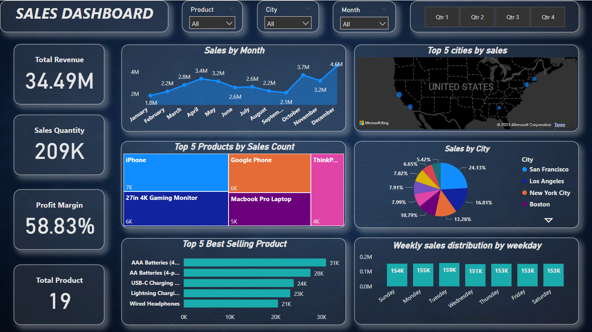

# Sales Data Analysis

The primary goal of this project was to extract meaningful insights by analyzing and visualizing sales data. This analysis aimed to uncover trends, identify top-selling products, and assess key revenue metrics such as total sales and profit margins for the business.

## Dashboard preview

## Tools

- Microsoft Excel: For data cleaning and preprocessing.
- Microsoft Power BI: Used for in-depth analysis, complex calculations, and creating interactive dashboards.

## Key Insights:
- Total Revenue: 34.49 million
- Total items sold: 209,000
- Total Profit Margin: 58.83%
- Total products: 19
- Cities covered: 9
- Month with the highest sales: December
- Month with the lowest sales: January
- City with the highest Sales revenue: San Francisco
- City with the lowest Sales revenue: Austin
- Top-selling product: MacBook Pro Laptop
- Least selling product: AAA Batteries

## Data Source

Sales dataset is given by MeriSKILL. [Click here](./Sales%20Data.csv) to show the datasets