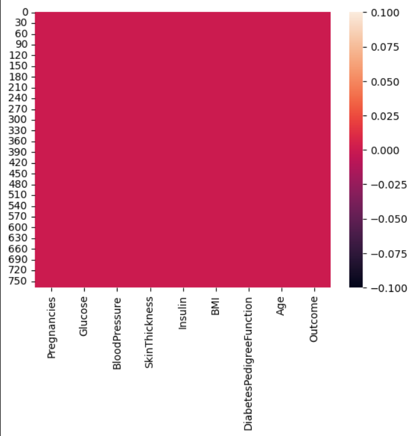
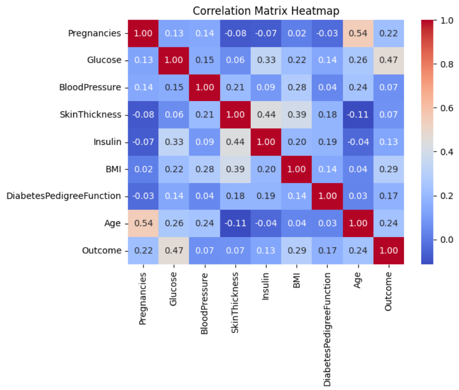
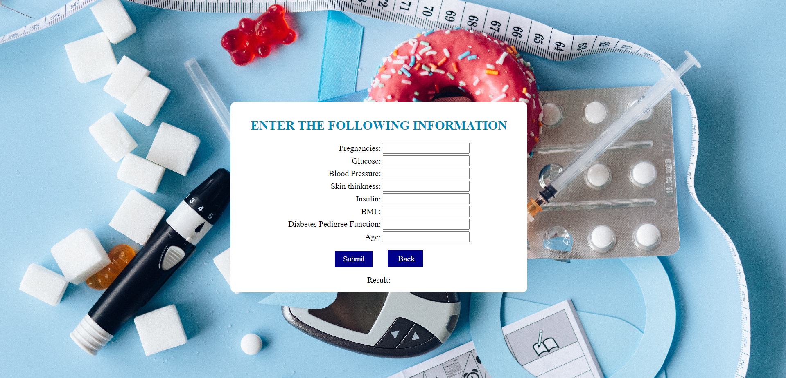

# Diabetes Prediction for Patients

The project aims to predict if a patient has diabetes using specific diagnostic measurements provided in the dataset, serving as a diagnostic tool for identifying potential diabetic conditions.

## Tools and Framework

- Python libraries(Pandas, Numpy, Scikit-learn, Matplotlib, Seaborn)
- Jupyter Notebook
- Django 
- VS Code

## Prediction Method

- Here i have used ***logistic regression*** algorithm to find out prediction from the model based on given diabetes dataset.

## Result

  

  

## Diabetes Prediction System

  

  

## Data Source

Diabtes dataset is given by MeriSKILL. [Click here](diabetes.csv) to show the dataset

